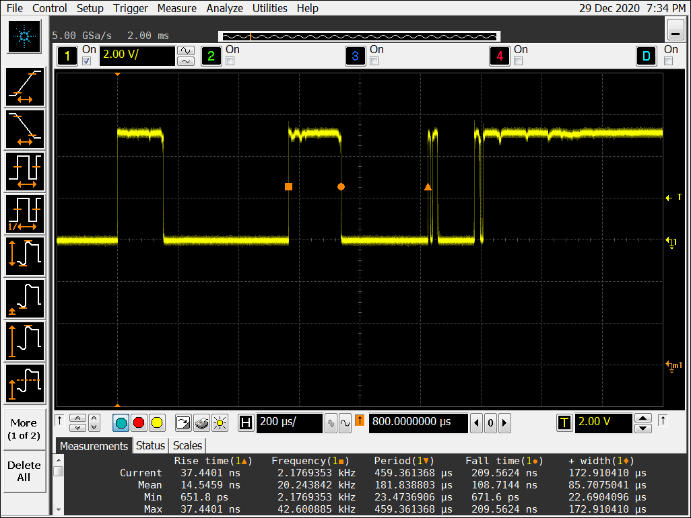
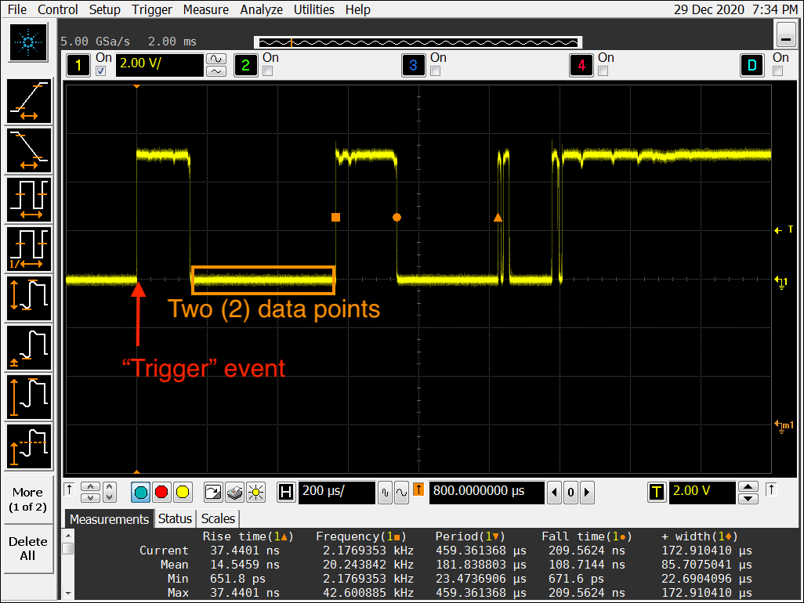

# PWL files simulate contact bounce in LTspice

[LTspice](https://www.analog.com/en/design-center/design-tools-and-calculators/ltspice-simulator.html) is a free (not open, but free) circuit analysis program maintained by Linear Technology, and their *corporate parent* Analog Devices. A [PWL ("Piece-Wise Linear") file](https://www.analog.com/en/technical-articles/ltspice-piecewise-linear-functions-for-voltage-current-sources.html) describes a *custom waveform* that may serve as an input source (voltage or current) in LTspice, and circuit performance to that input may be analyzed. Looked at this way, a PWL file may be useful in predicting the response of a circuit to non-typical or random inputs. For example, how does a circuit react to ***"contact bounce"*** when a switch is closed (or opened) while connected to that circuit?    

The LTspice documentation provides information on methods for creating a PWL file [here](https://www.analog.com/en/technical-articles/ltspice-importing-exporting-pwl-data.html) - and [here](https://www.analog.com/en/technical-articles/ltspice-piecewise-linear-functions-for-voltage-current-sources.html). These methods work fine for some waveforms, but may be very tedious for creating a high fidelity model of contact bounce. Further, it has been shown that [each switch has its own unique way of bouncing](https://www.eejournal.com/article/ultimate-guide-to-switch-debounce-part-1/), and so there is no such thing as a "general" - or *"one-size-fits-all"* model for contact bounce. All of these things (and more) were on my mind when I resolved to attempt to create a [*better mousetrap*](https://idioms.thefreedictionary.com/build+a+better+mousetrap). 

Conceptually, my mousetrap was simple, and not even innovative: Capture contact bounce on an oscilloscope, and ***export*** the waveform data to PWL data format. I had a few manual toggle switches on hand, and so I set up [my scope](https://www.keysight.com/en/pdx-x201760-pn-MSO9104A/mixed-signal-oscilloscope-1-ghz-4-analog-plus-16-digital-channels?nid=-32534.1150138&cc=US&lc=eng&pm=ov) to capture the bounce. It wasn't difficult to set up the measurement (here's a file exported from the scope detailing my setup), and soon I was capturing all sorts of [*random* waveforms](https://imgur.com/a/JcRDZ7k). It was fascinating to see how much variance existed in each closure of the same switch! 

| 1. Scope Measurement Screenshot | 2. Scope Measurement Screenshot & Comments |
| -------------------------- | -------------------------- |
|

Once I exported the first data file from the oscilloscope, I realized constructing the PWL file would be more challenging than it seemed at first. From the scope's *export menu* I chose the CSV format. A short time later I had a 277MB file with 10 million data points (voltage vs time) at 0.2 nanosecond intervals. This was far more data than needed, and far more data than LTspice could handle on my Mac[Note 1](#f1). Here's the [rather large CSV file](https://drive.google.com/file/d/14TgyNHGOWcfiwsI2c3uICQXNFt6SBPWj/view?usp=sharing) containing all the data points for the contact bounce measurement #7 pictured in the screenshot above (CB07).  

And so, here's the challenge: ***How to create a small-ish PWL file for LTspice from a 277MB CSV file downloaded from the oscilloscope?***     [***TO BE CONTINUED***]

---

## Notes: 

   * <b id="f1">Note 1 : </b>In response to a query re size limits on PWL files, an Analog Devices support engineer has suggested that 500K data points is a practical limit. [↩](#a1) 

## References, Resources & Further Reading

1. [Max Maxfield's 9-part saga on debouncing, which includes both hardware **and** software solutions](https://www.eejournal.com/article/ultimate-guide-to-switch-debounce-part-5/) 
2. [Jack Ganssle's 2-part article, which also offers a hardware & software solutions](http://www.ganssle.com/debouncing-pt2.htm)  
3. [Recognizing and Coping with Contact Bounce on the Raspberry Pi](https://www.dummies.com/computers/raspberry-pi/recognizing-and-coping-with-contact-bounce-on-the-raspberry-pi/) 
4. [Switch Bounce and How to Deal with It](https://www.allaboutcircuits.com/technical-articles/switch-bounce-how-to-deal-with-it/) 
5. [What is Switch Bouncing and How to prevent it using Debounce Circuit](https://circuitdigest.com/electronic-circuits/what-is-switch-bouncing-and-how-to-prevent-it-using-debounce-circuit) 
6. [LTspice and mechanical switch problem](https://www.eevblog.com/forum/beginners/ltspice-and-mechanical-switch-problem/msg3162872/#msg3162872) 
7. [Anyone have a .pwl file describing contact bounce for use in LTspice?](https://www.eevblog.com/forum/projects/anyone-have-a-pwl-file-describing-contact-bounce-for-use-in-ltspice/msg3370850/#msg3370850) 
8. [Q&A: What is the proper way to debounce a GPIO input?](https://raspberrypi.stackexchange.com/questions/118349/what-is-the-proper-way-to-debounce-a-gpio-input) 